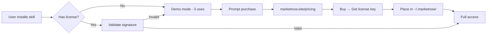

# MarketNow Skill Pricing & Activation System

## Skill Pricing

| # | Skill | Price | Tier |
|---|-------|-------|------|
| 1 | Multi-Platform Publisher | **$47** | Premium |
| 2 | MemCore AI | **$39** | Premium |
| 3 | Agent Pricing Engine | **$57** | Premium |
| 4 | Multimodal Content Factory | **$44** | Premium |
| 5 | Autonomous QA Agent | **$49** | Premium |
| 6 | Lead Generation Automator | **$67** | Premium |
| 7 | API Marketplace Aggregator | **$34** | Standard |
| 8 | Agent Ecommerce Suite | **$79** | Premium |
| 9 | Cross-Platform Browser Agent | **$44** | Premium |
| 10 | Agent Sentiment Orchestrator | **$54** | Premium |

- **Bundle All 10:** **$297** (ahorras $217 respecto a compra individual)
- **Bundle Publishing + Content:** **$79** (Publisher + Content Factory)
- **Bundle Sales Suite:** **$99** (Pricing Engine + Lead Gen + Ecommerce)

## Bundle Savings

```
Individual total:  $514
Bundle All 10:     $297  ← 42% OFF
Bundle Premium 9:  $480  ← incluye todos menos API Aggregator
Bundle Sales:      $203  ← Pricing + Leads + Ecommerce + Sentiment
Bundle Content:    $91   ← Publisher + Content Factory + Sentiment
Bundle Dev Tools:  $83   ← QA + API Agg + Browser Agent
```

## Payment Methods

- **Direct:** PayPal, Stripe, Crypto (USDC/USDT)
- **ClawHub:** Free download + license key required (watermark/demo mode)

## License System

Each skill includes a `scripts/license.py` that:
1. Checks for a local license file (`~/.marketnow/license-<slug>.key`)
2. Validates HMAC-signed license against a master key
3. Falls back to watermark/demo mode (3 uses) if unlicensed
4. Calls home once per activation for validation

## Activation Flow



## How to Buy

1. Visit **https://marketnow.site/pricing**
2. Select skill(s) or bundle
3. Pay via PayPal, Stripe, or USDC
4. Receive license key via email
5. Run `marketnow-activate <skill-slug> <license-key>`
6. Enjoy full access

## License Script

```python
# scripts/license.py - License validation
# Place in ~/.marketnow/license-<slug>.key
# Format: BASE64(HMAC_SHA256(slug + email + tier, MASTER_KEY))
```
